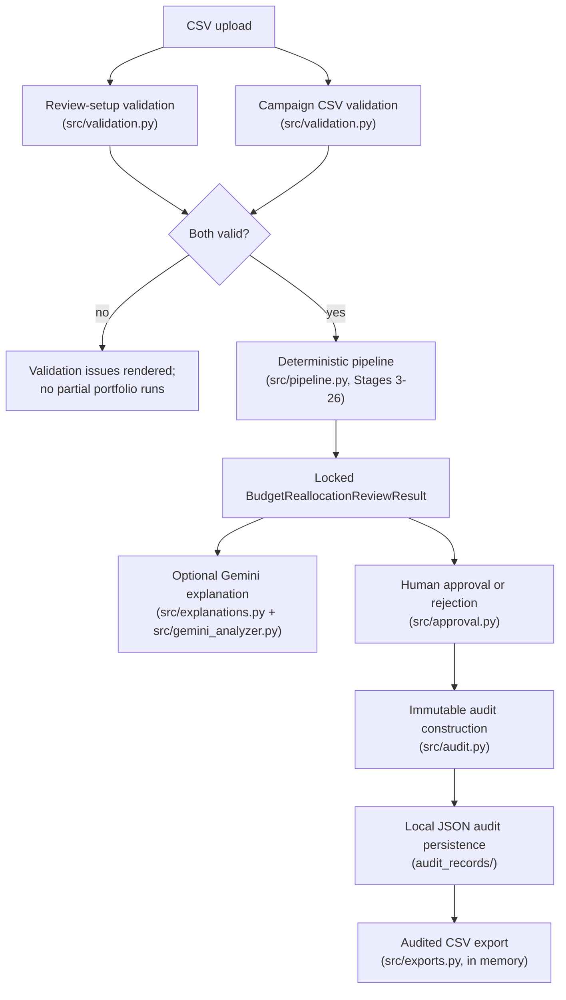

# Architecture

> Sprint 4, Development Stage 41 (Human-in-the-Loop, Audit, and Governance Completeness
> Review). Reflects the completed Sprint 1–3 implementation (Development Stages 1–36) plus
> Sprint 4's Stages 37–40 (living documentation, README, packaging/dependency hardening,
> and test-suite hardening). Every module, model, and function named below exists in the
> repository exactly as described; nothing in this document is speculative or planned.
> Sprint 4 remains incomplete.

## Overview

The AI Budget Reallocation Agent is a human-in-the-loop Streamlit application that turns
uploaded Google Ads/Meta Ads campaign performance data into constrained,
fully-traceable budget-reallocation recommendations, optionally explains those
already-locked recommendations in plain language using the Gemini API, requires an
explicit human approval or rejection decision, records that decision as an immutable
local JSON audit record, and makes an audited CSV available for download. The
application never writes back to Google Ads, Meta Ads, or any other advertising
platform — every output is a recommendation, an explanation, an audit record, or a CSV
export for a human to act on manually outside the application.

## System Purpose and Trust Model

Three trust tiers govern every decision the system makes, and no code path ever crosses
a tier boundary in the wrong direction:

1. **Deterministic core (authoritative).** All budget-reallocation numbers —
   recommendations, allocated amounts, scores, ranks, and the conservation check — are
   computed by plain, non-AI Python using `Decimal` arithmetic (`src/metrics.py` through
   `src/pipeline.py`). This is the only tier permitted to decide *what* a campaign's
   recommendation is.
2. **Gemini explanation layer (supplementary, non-authoritative).** `src/explanations.py`
   and `src/gemini_analyzer.py` may only narrate, in plain language, facts the
   deterministic core already locked. No model or function in either module can write a
   value back into a locked deterministic result — `ExplanationResult`
   (`src/gemini_analyzer.py`) has no field capable of representing an action, amount,
   score, rank, or conservation value, so there is no path by which Gemini's output could
   ever influence a recommendation.
3. **Human decision (accountable).** `src/approval.py` requires one named human to
   explicitly approve or reject the complete locked portfolio before anything is recorded
   as final. Gemini is never consulted for, and has no path to influence, this decision.

## Repository / Module Boundaries

| Module | Responsibility | Sprint / Stage |
|---|---|---|
| `src/constants.py` | Frozen enumerations and numerical thresholds; no logic | Sprint 2, Stage 1 |
| `src/models.py` | `ReviewSetup`, `CampaignInput`, the `Currency`/`ConventionalBool` types | Sprint 2, Stage 1 |
| `src/validation.py` | CSV/schema validation, translating Pydantic errors into `ValidationIssue`/`ValidationReport` | Sprint 2, Stage 2 |
| `src/metrics.py` | Direction-normalized CPA/ROAS performance-ratio facts | Sprint 2, Stage 3 |
| `src/pacing.py` | Calendar/spend pacing facts (Stage 4) and neutral pacing-status classification (Stage 9) | Sprint 2, Stages 4, 9 |
| `src/classification.py` | Neutral performance, trend, conversion-volume-confidence, and tracking-assessability classification | Sprint 2, Stages 5–8 |
| `src/constraints.py` | Static budget bounds, applicable change percentage, raw percentage movement cap, test-floor distance, protection constraint, test-aware decrease room, raw increase/decrease limits, protection-adjusted effective decrease limit | Sprint 2, Stages 10–18 |
| `src/availability.py` | Mechanical/operational action availability | Sprint 2, Stage 19 |
| `src/suitability.py` | Conservative, diagonal-only per-action suitability | Sprint 2, Stage 20 |
| `src/recommendation.py` | Final `RecommendationAction` selection (`INCREASE`/`MAINTAIN`/`REDUCE`/`HOLD`) | Sprint 2, Stage 21 |
| `src/reasons.py` | Ordered `ReasonCode` tuple explaining the selected action | Sprint 2, Stage 22 |
| `src/scoring.py` | Per-campaign, direction-scoped priority score | Sprint 2, Stage 23 |
| `src/ranking.py` | Cross-campaign, direction-separated dense ranking | Sprint 2, Stage 24 |
| `src/allocation.py` | Cross-campaign monetary allocation from ranked candidates | Sprint 2, Stage 25 |
| `src/conservation.py` | Independent monetary conservation verification | Sprint 2, Stage 26 |
| `src/pipeline.py` | End-to-end deterministic orchestration; `run_budget_reallocation_review` | Sprint 2, Stage 27 |
| `app.py` | Streamlit interface tying every stage together | Sprint 3, Stages 28, 32–35 |
| `config.py` | Gemini API-key configuration boundary | Sprint 3, Stage 29 |
| `src/explanations.py` | Explanation payload/prompt construction from locked results | Sprint 3, Stage 30 |
| `src/gemini_analyzer.py` | Gemini transport (`google-genai` SDK) | Sprint 3, Stage 31 |
| `src/approval.py` | Human approval/rejection workflow | Sprint 3, Stage 33 |
| `src/audit.py` | Immutable local JSON audit record construction and persistence | Sprint 3, Stage 34 |
| `src/exports.py` | In-memory audited CSV construction | Sprint 3, Stage 35 |
| `tests/test_integration.py` | Full end-to-end integration coverage | Sprint 3, Stage 36 |

Each module in the deterministic core (`src/metrics.py` through `src/pipeline.py`)
consumes only the already-approved output of the stage(s) immediately upstream of it — it
never recomputes, re-validates, or reinterprets a fact an earlier stage already produced.
This "consume, don't recalculate" discipline is enforced throughout by AST-based isolation
tests in each module's own test file, which assert the exact set of upstream
functions/models each module is and is not permitted to import.

## Deterministic Core Pipeline

### Validation Boundary (`src/validation.py`, `src/models.py`)

`ReviewSetup` (reviewer-entered review parameters: `review_id`, `review_date`,
`period_start`, `period_end`, `reviewer_name`, `approved_monthly_budget`,
`initial_account_reserve`, `default_max_change_percentage`, optional `review_notes`) and
`CampaignInput` (one row of the uploaded CSV) are the sole authoritative source of
structural rules — `validate_review_setup`/`validate_campaign_csv` only invoke these
Pydantic models and translate their `pydantic.ValidationError` output into
`ValidationIssue` records inside a `ValidationReport`; no structural rule is
re-implemented outside `src/models.py`. The campaign CSV schema is fixed at exactly 20
columns, in exact header order (`data/campaign_template.csv`):
`campaign_id, campaign_name, platform, status, kpi_type, kpi_target, current_budget,
minimum_budget, maximum_budget, spend_to_date, conversions_7d, conversions_28d,
kpi_actual_7d, kpi_actual_28d, tracking_status, business_priority, is_protected,
is_test_campaign, test_budget_floor, campaign_max_change_percentage`. A header mismatch
produces one file-level issue with no row validation attempted; any row-level or
file-level error blocks the entire portfolio — the deterministic pipeline never runs on a
partial or partially-invalid CSV.

### Metrics and Classifications (`src/metrics.py`, `src/pacing.py`, `src/classification.py`)

`calculate_campaign_metrics` produces direction-normalized 7-/28-day performance ratios, a
weighted blend, and a trend delta — facts only. `calculate_campaign_pacing` produces
calendar/spend-pacing facts independently of metrics. Four independent, neutral
classifications are then derived, each reading only its own narrow input: `PerformanceBand`
(`ABOVE_TARGET`/`ON_TARGET`/`BELOW_TARGET`, from the weighted ratio), `TrendDirection`
(`IMPROVING`/`STABLE`/`DECLINING`, from the trend delta), `Confidence` (from
`conversions_28d`, against `MINIMUM_CONVERSIONS`/`HIGH_CONFIDENCE_CONVERSIONS` — this
function assigns only `HIGH`/`MEDIUM`/`LOW`; see "Reserved-But-Unemitted Values" below for
`Confidence.NOT_ASSESSABLE`), and `PacingStatus` (`UNDERSPENDING`/`ON_PACE`/
`OVERSPENDING`/`NOT_AVAILABLE`, from `pacing_ratio` alone). `assess_campaign_tracking`
separately produces `is_assessable: bool` from `tracking_status` — `WARNING` remains
assessable; only `UNRELIABLE` is not. None of these five facts overwrites, weights, or
combines with any other.

### Constraints (`src/constraints.py`, Stages 10–18)

Nine sequential, purely-consuming stages resolve, in order: the static distance to
`maximum_budget`/`minimum_budget`; which change-percentage applies (campaign override or
review default); the raw percentage-based monetary cap; the raw distance to a test
campaign's `test_budget_floor`; the boolean decrease-blocking effect of
`is_protected`; the test-aware static decrease room (the stricter of the static-minimum
and test-floor distances); the raw increase limit (`min` of static-maximum room and the
percentage cap); the raw decrease limit (`min` of the test-aware decrease room and the
percentage cap); and the protection-adjusted effective decrease limit (`Decimal("0.00")`
when protected, the raw decrease limit unchanged otherwise). Each stage consumes only the
prior stage's typed result object — never `CampaignInput` fields already absorbed
upstream.

### Availability, Suitability, Recommendation, Reasons, and Scoring (Stages 19–23)

`resolve_campaign_action_availability` determines whether `INCREASE`/`MAINTAIN`/`REDUCE`
are each *mechanically* possible (active status, assessable tracking, positive relevant
capacity) — never whether an action is advisable. `resolve_campaign_action_suitability`
then applies a conservative, diagonal-only rule: only the three cells where
`PerformanceBand`/`TrendDirection` unambiguously align with one available direction are
marked `SUITABLE`; every other combination is `NEUTRAL`, `UNSUITABLE`, or
`NOT_APPLICABLE` (when the action was already unavailable).
`resolve_campaign_recommendation_action` (`src/recommendation.py`) then selects exactly
one final `RecommendationAction` per campaign via a fully-implemented, six-step ordered
policy (see "HOLD" below). `resolve_campaign_recommendation_reason` (`src/reasons.py`)
explains that already-selected action with a non-empty, ordered `ReasonCode` tuple (see
"ReasonCode Emission" below). `calculate_campaign_reallocation_priority_score`
(`src/scoring.py`) then computes one `int` priority score per campaign, comparable only
within its own recommendation direction.

### Ranking, Allocation, and Conservation (Stages 24–26)

`rank_campaign_reallocation_priorities` produces two completely independent,
direction-scoped, dense-ranked sequences (`increase_rankings`/`reduce_rankings`) —
`INCREASE` and `REDUCE` candidates are never compared against each other.
`allocate_campaign_reallocation` converts these ranked populations into actual,
balanced, campaign-level monetary movements, using each campaign's already-resolved raw
increase limit or effective decrease limit as a maximum capacity (never a guaranteed
movement). `ReviewSetup.initial_account_reserve` is deliberately excluded from every
allocation calculation — it is protected, non-reallocatable budget, never read by
`src/allocation.py`. `verify_campaign_reallocation_conservation` independently re-sums the
allocation's own increase/decrease totals and reports `is_conserved` — it is a pure,
read-only checker that never reruns allocation and never repairs an imbalance.

### Stage 27 Orchestration (`src/pipeline.py`)

`run_budget_reallocation_review(review, campaigns)` is the single entry point that calls
every one of the above functions, in their exact frozen dependency order, over one
already-validated `ReviewSetup` and campaign tuple, and returns one
`BudgetReallocationReviewResult` — `review_id`, an ordered tuple of
`CampaignBudgetRecommendationResult` (one row per campaign, original upload order
preserved), `total_current_budget`, `total_recommended_budget`, and the embedded
`CampaignReallocationConservation`. It never reimplements a rule any upstream function
already owns, and it always returns a result — an unconserved allocation is reported, not
hidden or repaired, and is never a reason to raise.

## Streamlit Interface (`app.py`)

`app.py` is a thin orchestration layer over the deterministic core and the Sprint 3
capabilities — it contains no business formula, no validation rule, and no Gemini prompt
logic of its own. `main()` renders, in order: the review-setup form and CSV uploader; on
submission, `_handle_submission` validates and (only if valid) calls
`run_budget_reallocation_review` and stores the result; if a locked result exists, it
renders the read-only result table, the optional Gemini explanation section, the human
approval section, and — only once an audit record has actually been persisted — the CSV
export section.

### Optional Gemini Configuration

`config.load_gemini_config()` sources `GEMINI_API_KEY` from the process environment
(authoritative when present, including when blank) or, only when the variable is entirely
absent, from a local `.env` file at a fixed repository-root path — never the process's
current working directory. A missing, blank, or whitespace-only key is a normal,
non-error `GeminiConfig(api_key=None)` state. The key is held in `pydantic.SecretStr`,
never logged, printed, or exposed in any rendered UI element or session-state value.
`app.py` never accesses `config.api_key` directly, never calls `.get_secret_value()`
itself, and never stores a `GeminiConfig` object in session state.

### Locked Explanation Payload and Prompt Construction (`src/explanations.py`)

`build_portfolio_explanation_payload`/`build_campaign_explanation_payload` copy only an
explicitly authorized subset of fields directly from an already-locked
`BudgetReallocationReviewResult`/`CampaignBudgetRecommendationResult` — never raw CSV
data, review notes, intermediate constraint facts, or configuration. Campaign and
portfolio payloads are structurally separate (a campaign payload never contains
sibling-campaign data; a portfolio payload never contains a campaign list).
`serialize_explanation_payload` produces compact, deterministic, canonical JSON (fixed
field order, `Decimal` as fixed-point strings, enums as `.value`). One fixed,
author-controlled system instruction — identical for every request, containing no
campaign data itself — states plainly that the supplied JSON is locked and authoritative
and that the model explains but never decides.

### Gemini Transport Boundary (`src/gemini_analyzer.py`)

`generate_explanation(prompt, config)` uses the `google-genai` SDK exclusively (the sole
SDK declared in `requirements.txt` and actually installed). When Gemini is unavailable
(`is_gemini_available(config)` is `False`), it returns a real, network-free
`ExplanationResult(status=UNAVAILABLE, ...)` — no client is ever constructed. Otherwise it
constructs exactly one short-lived `google.genai.Client` for that single call (closed in a
`finally` block regardless of outcome), with a fixed model (`gemini-2.5-flash-lite`),
temperature, output-token limit, and timeout. Every failure mode (authentication, rate
limit, timeout, network, safety block, empty/malformed response, or any other exception)
is mapped to a typed `FAILED` result with a sanitized message — the raw key is
defensively redacted out of any caught exception's text before it reaches
`error_message`. No automatic retry ever occurs. `ExplanationResult` has no field capable
of representing an action, amount, score, rank, or conservation value.

## Human Approval/Rejection (`src/approval.py`)

`CampaignReallocationApproval` reuses the existing `ReviewStatus` enum (from
`src/constants.py`) rather than a separate approval-specific enum, restricted by a
`@field_validator` to `APPROVED`/`REJECTED` only. `approve_campaign_reallocation_review`
and `reject_campaign_reallocation_review` each require a non-blank `reviewer_name`
(`ValueError("Reviewer name must not be blank.")` otherwise); approval additionally
requires `result.conservation.is_conserved is True`
(`ValueError("An unconserved allocation cannot be approved.")` otherwise) — rejection has
no such restriction, since a human must remain free to reject a mathematically broken
allocation. The decision applies to the complete locked portfolio only — there is no
per-campaign or partial approval. The reviewer's name and optional note are captured
directly on `CampaignReallocationApproval` (`reviewer_name`, `note`) — they are not a
separate log entry; both fields travel unchanged into the audit record built in the same
click (`src/audit.py`), so the human decision record and its accountable identity are one
and the same object. Once rendered as finalized, no control anywhere in the UI can
overwrite or reconsider a stored decision; only a new deterministic submission clears it.

## Immutable Audit Construction and Local JSON Persistence (`src/audit.py`)

`CampaignReallocationAudit` embeds the exact frozen `BudgetReallocationReviewResult` and
`CampaignReallocationApproval` objects directly — never a copied or re-derived summary.
`build_campaign_reallocation_audit(result, approval, recorded_at)` is pure (no file,
clock, or network access of its own); it re-checks `approval.review_id ==
result.review_id` and, for an `APPROVED` decision only, `result.conservation.is_conserved`,
raising the same class of exact `ValueError` as `src/approval.py` if either fails.
`audit_id` is a deterministic SHA-256 digest of the canonical JSON of `{"result":
result, "approval": approval}` — deliberately excluding `recorded_at`, since including a
wall-clock value in the digest would give an identical decision a different ID on every
retry; excluding it is what makes a retried write of the same decision always resolve to
the same file regardless of when the retry happens. `recorded_at` itself must be
timezone-aware — a naive `datetime` is rejected by a `@field_validator`
(`ValueError("recorded_at must be timezone-aware")`) — and is always normalized to UTC on
construction, so every stored audit's timestamp is directly comparable regardless of the
caller's local timezone. `record_campaign_reallocation_audit` writes exactly one UTF-8
JSON file per record to `audit_records/{audit_id}.json` (the directory is resolved from
`src/audit.py`'s own file location, never the current working directory), via a temporary
file plus an atomic `os.replace` — a write that already exists with matching content
(compared on every field except `recorded_at`, since the first successful write's
timestamp is authoritative) is an idempotent no-op returning the existing path unchanged.
A pre-existing file under the same `audit_id` with genuinely different content raises
exactly `ValueError("An audit record with this audit_id already exists with different
content.")`; a pre-existing file that cannot be parsed and validated back into
`CampaignReallocationAudit` raises without being overwritten or repaired — neither case is
ever silently resolved. The one production wall-clock call (`datetime.now(timezone.utc)`)
lives in `app.py`'s `_attempt_audit_recording`, never inside `src/audit.py` itself. This is
local JSON file persistence, not a production database — see `docs/LIMITATIONS.md` for the
absence of a query engine, indexing, replication, retention system, distributed locking,
and automatic backup.

## In-Memory Audited CSV Export (`src/exports.py`)

`build_campaign_reallocation_export_rows(audit)` and
`serialize_campaign_reallocation_export_csv(rows)` consume only an already-built,
already-persisted `CampaignReallocationAudit` — never a separate result/approval pair,
never a re-read from disk, and never any Stage 1–34 production function; `src/exports.py`
imports no Gemini SDK, `config`, `src.explanations`, or `src.gemini_analyzer`, so an export
can never trigger a Gemini call, recompute a recommendation, or mutate the audit it reads.
Both `APPROVED` and `REJECTED` audits are exportable, identically — the module never
branches on `decision` beyond copying its `.value` into the row, so a rejection never
rewrites, relabels, or reinterprets the deterministic recommendations that were reviewed;
the CSV remains a factual record of what was recommended and what was decided. The export
is one flat CSV, one row per campaign, in the locked result's own original order, with the
shared audit/approval/portfolio/conservation context repeated on every row so each row is
independently self-contained. `Decimal` values render via `format(value, "f")`; a
one-apostrophe formula-injection prefix is applied only to the five textual fields that can
carry uploaded or human-entered text (`review_id`, `reviewer_name`, `decision_note`,
`campaign_id`, `campaign_name`) when their first non-whitespace character is
`=`/`+`/`-`/`@` — every other column (enum values, the `is_conserved` boolean, the
audit-ID hash, timestamps, and `Decimal` strings) is trusted, computed data and is never
passed through this neutralization. In `app.py`, the export section is gated on both
`AUDIT_RECORD_PATH_STATE_KEY` and `AUDIT_RECORD_STATE_KEY` being present — it only renders
once `record_campaign_reallocation_audit` has actually returned successfully, never on the
approval decision alone. The CSV is generated entirely in memory and handed to Streamlit's
`st.download_button` — no export file is ever written to the server filesystem, and no
`exports/` directory exists anywhere in this repository.

## Session-State Lifecycle (`app.py`)

Eight session-state keys govern the entire post-submission UI: `locked_review_result`,
`portfolio_explanation_result`, `campaign_explanation_result`,
`campaign_explanation_campaign_id`, `approval_decision_result`, `audit_record_path`,
`audit_record_error`, and `audit_record` (the last three added at Stages 34–35). All eight
are cleared together at the very start of every new deterministic-review submission
(successful or failed), before validation runs. An ordinary rerun (no button clicked)
preserves every key unchanged and triggers no re-computation, no Gemini call, and no
audit write. A successful approve/reject click stores the decision and — in the same
click — attempts audit persistence; `audit_record`/`audit_record_path` are populated only
once `record_campaign_reallocation_audit` actually returns successfully, which is also
the sole gate for the CSV export section's visibility.

## Complete End-to-End Data Flow

## Human-in-the-Loop Boundary

- All budget-reallocation numbers are computed deterministically, before any AI model is
  involved.
- Gemini explains only already-locked, already-computed results; it is never consulted
  during computation and cannot alter a recommendation, an amount, a score, a rank, an
  approval, or an audit record.
- A human must explicitly approve or reject the complete locked portfolio before an audit
  record is created; there is no automatic or default decision.
- The application never changes live advertising-platform budgets — every output is a
  recommendation, an explanation, a local audit record, or a downloadable CSV for a human
  to act on manually.

## AI Isolation and Lack of Authority

Structural guarantees, not just behavioral convention: `ExplanationResult` has no field
that can represent a recommendation, amount, score, rank, or conservation value; the
approval, audit, and export layers never import `src.explanations` or
`src.gemini_analyzer` and never read a Gemini result when building their own outputs.
`CampaignReallocationAudit` and the exported CSV are built solely from the deterministic
`BudgetReallocationReviewResult` and the human `CampaignReallocationApproval` — Gemini
explanation text can never enter either artifact.

## Security and Secret-Handling Boundaries

The Gemini API key is sourced only through `config.load_gemini_config()`, held in
`pydantic.SecretStr` (redacted from `repr`/`str`/serialization), and never stored in
Streamlit session state, never logged, and never rendered. `src/gemini_analyzer.py`
defensively redacts the raw key out of any caught exception's message before it reaches a
typed `error_message`. No module reads an environment variable directly outside
`config.py`, and no module other than `config.py` reads `.env`.

## Persistence Boundaries

The only two things this application ever writes to disk are: (1) exactly one JSON file
per finalized human decision, under `audit_records/`; (2) nothing else — the CSV export is
generated entirely in memory and never written to the server filesystem. There is no
database, no cloud storage, and no other persistence mechanism anywhere in the codebase.

## Failure Behaviour

Every user-facing action boundary (pipeline execution, Gemini explanation generation,
audit persistence, CSV export construction) is wrapped in exactly one exception boundary
that shows a concise, generic, sanitized message — never a raw exception, stack trace,
secret, or absolute filesystem path — and never fabricates a partial or default result. A
failed audit write leaves the human decision finalized (never reopened or replaced) and
offers one manual retry control; a failed CSV export leaves the locked result, approval,
and audit record entirely unchanged.

## Explicit Absence of Advertising-Platform Integrations

No module anywhere in this repository reads from or writes to Google Ads, Meta Ads, or any
other advertising platform's API. The only input channel is a manually uploaded CSV file;
the only outputs are on-screen recommendations, an optional Gemini explanation, a local
JSON audit file, and a downloadable CSV. There is no code path — reviewed at every
Sprint 3 stage and re-confirmed by the Stage 36 integration suite — by which this
application can alter a live advertising-platform budget.

## Test Architecture: Fake-Client and Network-Free Approach

Every test in this repository — including the full Stage 36 integration suite — runs
without a real Gemini API key and without any real network call. Two techniques make this
possible: the genuine, network-free `UNAVAILABLE` path (`GEMINI_API_KEY` absent, the real
`generate_explanation` returns a typed result with no client construction), and a narrow
structural protocol (`GeminiClient`) that a test double can satisfy without implementing
the full SDK client, used directly in `tests/test_gemini_analyzer.py`. Streamlit UI tests
use `streamlit.testing.v1.AppTest`, most commonly via `AppTest.from_string` with a fake
`generate_explanation`/redirected `record_campaign_reallocation_audit` embedded directly in
the executed script — the only mechanism that reliably intercepts these calls, since
`AppTest.from_file` executes `app.py` in a namespace that does not honor an external
`monkeypatch` of them. Every scenario that persists an audit redirects the write to a
pytest `tmp_path`, never the repository's real `audit_records/` directory.

## HOLD, Confidence.NOT_ASSESSABLE, and ReasonCode: Actual Implemented State

### `RecommendationAction.HOLD` — fully implemented (Stage 21)

`HOLD` is not a placeholder or an unresolved case. `resolve_campaign_recommendation_action`
(`src/recommendation.py`) selects it via an exact, ordered, six-step policy applied to
every campaign: (1) `campaign.status is CampaignStatus.PAUSED` → `HOLD`, overriding all
suitability; (2) otherwise `not tracking.is_assessable` → `HOLD`; (3) otherwise exactly
one of `increase_suitability`/`maintain_suitability`/`reduce_suitability` is `SUITABLE` →
that action is selected; (4) otherwise more than one is `SUITABLE` → `HOLD` (an ambiguity
outcome, unreachable through the approved Stage 20 production table but handled
defensively); (5) otherwise, if `maintain_suitability` is `NEUTRAL` → `MAINTAIN`; (6)
otherwise → `HOLD`. This policy is complete and requires no further stage.

### `Confidence.NOT_ASSESSABLE` — reserved enum member, never assigned

`classify_campaign_confidence` (`src/classification.py`, Stage 7) assigns only `HIGH`,
`MEDIUM`, or `LOW`, from `conversions_28d` compared against
`MINIMUM_CONVERSIONS`/`HIGH_CONFIDENCE_CONVERSIONS`. It never assigns
`Confidence.NOT_ASSESSABLE`. Tracking-based assessability is a separate, independent
boolean fact — `CampaignTrackingAssessment.is_assessable` (`assess_campaign_tracking`,
Stage 8) — that is never combined with `Confidence` by any production code. The
`Confidence.NOT_ASSESSABLE` enum member exists in `src/constants.py` and remains a
reserved, valid enum value, but no current production function ever constructs or returns
it.

### `ReasonCode` — 8 of 20 members are currently emitted

`resolve_campaign_recommendation_reason` (`src/reasons.py`, Stage 22) is the only function
that emits `ReasonCode` values, and it emits exactly these eight, each from a fully
implemented, exact trigger condition already described above and in
`docs/DECISION_RULES.md`: `PAUSED_CAMPAIGN`, `TRACKING_UNRELIABLE`,
`HELD_FOR_MANUAL_REVIEW`, `ABOVE_TARGET_STRONG`, `NEAR_TARGET`,
`RECENT_TREND_IMPROVING`, `RECENT_TREND_STABLE`, `RECENT_TREND_DECLINING`. The remaining
twelve enum members are defined in `src/constants.py` but are never emitted by any current
production function: `BELOW_TARGET_MODERATE`, `BELOW_TARGET_SEVERE`,
`STRONG_LONG_TERM_RECENT_DECLINE`, `CAMPAIGN_CAP_REACHED`, `CAMPAIGN_FLOOR_REACHED`,
`TEST_BUDGET_FLOOR_APPLIED`, `MAX_CHANGE_LIMIT_APPLIED`, `NO_ELIGIBLE_RECIPIENT`, and
`ACCOUNT_RESERVE_REQUIRED` are reserved but currently not emitted; `TRACKING_WARNING`,
`INSUFFICIENT_CONVERSION_VOLUME`, and `PROTECTED_FROM_REDUCTION` are intentionally
excluded from `src/reasons.py`'s emission logic even though each is diagnostically true in
some cases, because none causally participates in Stage 21's actual decision. No enum
member has been altered or removed.
